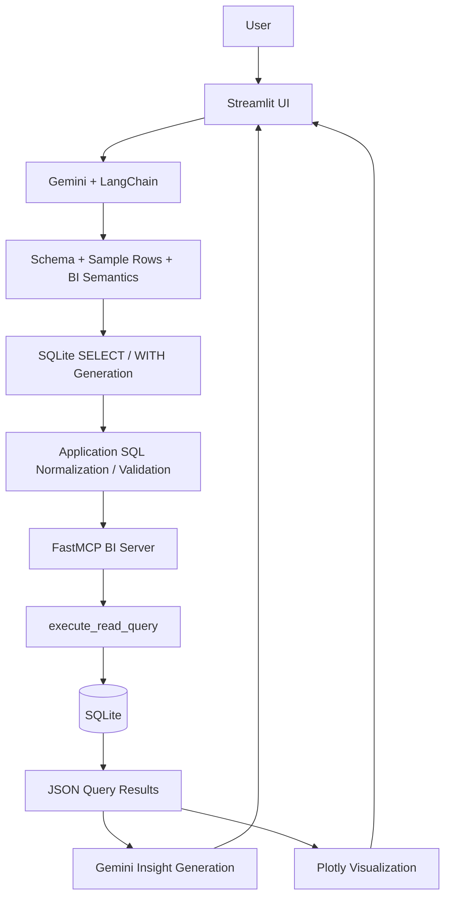
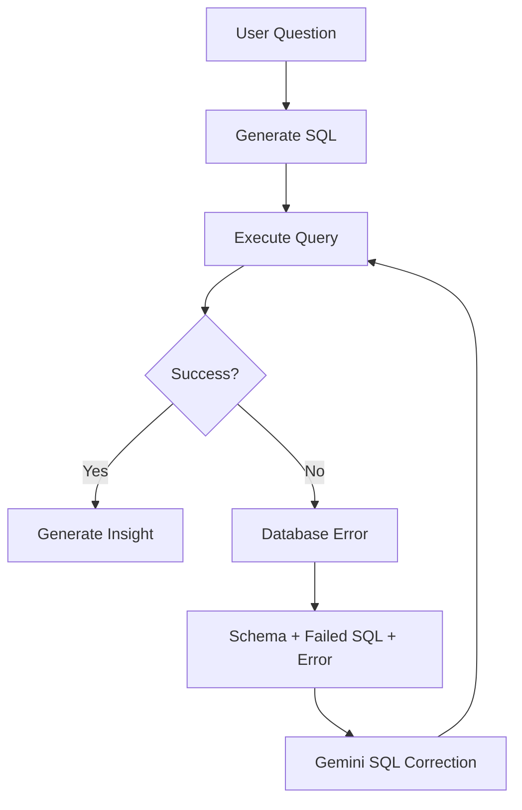

# Local Business Intelligence Assistant 📊

**GenAI-powered conversational BI agent for natural-language business data analysis**

This project is an **MVP implementation** of the Local Business Intelligence Assistant use case from a GenAI certification assignment.

The application lets a user ask business questions in natural language. The GenAI workflow uses **Gemini + LangChain** to generate SQL against a SQLite business database, accesses the database through an **MCP BI server**, validates generated SQL, retries once when a query fails, and turns returned data into a business-oriented response and visualization.

> **MVP scope:** Local Streamlit application, local SQLite database, MCP over stdio, and a Sweden business dataset.

---

## 1. What I Built

The MVP combines a conversational UI with an LLM-driven data-analysis workflow:

| Capability | Implementation |
|---|---|
| Natural-language BI questions | Gemini + LangChain |
| Text-to-SQL | Schema-aware SQLite SQL generation |
| Business grounding | Schema + sample rows + BI semantic metadata + latest data date |
| Database access | MCP / FastMCP |
| SQL controls | Application-side and MCP-side read-only validation |
| SQL recovery | One LLM-based correction attempt after a query error |
| Data processing | Pandas |
| Business explanation | Gemini-generated Summary / Key Insight / Recommendation |
| Visualization | Plotly, with LLM-generated Plotly expressions constrained and parsed before evaluation |
| User interface | Streamlit |
| Report workflows | Weekly / Monthly report prompts |
| Data ingestion | Excel → Pandas → SQLite |

---

## 2. Architecture

### High-level architecture



### Data ingestion path

```text
Excel Workbook
      ↓
Pandas
      ↓
SQLite
      ↓
FastMCP BI Server
      ↓
Streamlit / Gemini workflow
```

The ingestion script discovers workbook sheets, loads them with Pandas, writes them into SQLite, and creates indexes for selected fields.

---

## 3. End-to-End Request Flow

When a user submits a BI question, the application follows this workflow:

### Step 1 — User Question

The user enters a natural-language question in Streamlit, for example:

> Which products generated the highest revenue?

### Step 2 — MCP Session

The application launches the configured MCP BI server as a subprocess and establishes an MCP client session.

### Step 3 — Schema Retrieval

The application calls the MCP `get_database_schema` tool.

The schema response contains:

- SQLite table definitions
- Sample rows
- BI semantic rules
- Table-grain guidance
- Metric definitions
- Join guidance
- Relative-date guidance

### Step 4 — Context Construction

Before SQL generation, Gemini receives the database context together with:

- User question
- Database schema
- Sample rows
- Business semantics
- Latest available sales date
- SQL-generation rules

### Step 5 — Natural Language → SQL

Gemini generates one SQLite `SELECT` / `WITH` query.

The prompt explicitly instructs the model to:

- Use only existing tables and columns
- Use `SUM(total_revenue_sek)` for revenue
- Use `SUM(units_sold)` for units
- Respect defined low-stock logic
- Avoid unnecessary joins
- Avoid many-to-many joins
- Aggregate different-grain tables before joining
- Interpret relative dates using the latest available dataset date
- Respect explicitly named retailers
- Produce breakdowns for relevant “why / drop / increase / change” questions

### Step 6 — Application-side SQL Validation

The generated SQL is normalized before it is sent to the MCP server.

The application:

- Removes common SQL markdown fences
- Rejects empty responses
- Requires the statement to begin with `SELECT` or `WITH`
- Rejects multiple SQL statements

### Step 7 — MCP Query Execution

The validated query is sent to the MCP `execute_read_query` tool.

The MCP layer performs a second read-only validation before executing the query against SQLite.

### Step 8 — Error Recovery

If SQLite returns an error, the application performs **one controlled self-correction attempt**.

Gemini receives:

- Original question
- Schema
- Failed SQL
- Database error
- Latest available date
- SQL correction rules

It then returns corrected SQL, which is executed once more.

### Step 9 — Query Result Processing

The JSON result returned by MCP is converted into a Pandas DataFrame.

For insight generation, the application limits the insight input to **100 rows** to avoid unnecessarily large LLM prompts.

The full query result remains available in the Streamlit UI.

### Step 10 — Business Insight Generation

The returned data is passed to Gemini with explicit grounding instructions.

The model is asked to produce:

```text
📊 Summary
🔎 Key Insight
💡 Recommendation
```

The prompt instructs it to use only returned values, avoid invented numbers, avoid guessing, and avoid claiming causation when the data only demonstrates correlation.

### Step 11 — Visualization

When the query returns multiple rows and multiple columns, a second Gemini request can generate a Plotly expression based on the returned data shape.

The implementation supports patterns such as:

- Date + numeric → line chart
- Categorical + numeric → bar chart
- Numeric + numeric → scatter chart
- Small part-to-whole data → pie chart

The generated Plotly code is parsed with Python's AST machinery and only the `fig` expression is evaluated with a restricted builtins environment.

### Step 12 — Final Response

Streamlit displays:

- Business explanation
- Visualization, when applicable
- Optional generated SQL
- Optional raw query data

---

## 4. GenAI Workflow

The project uses Gemini for several distinct tasks rather than using the model as a generic chatbot.

```text
Natural-language question
        ↓
Schema-aware SQL generation
        ↓
Database execution
        ↓
Optional SQL correction
        ↓
Query result
        ↓
Business insight generation
        ↓
Visualization generation
```

The model is grounded with application-provided database context instead of being asked to answer business questions from general knowledge.

---

## 5. MCP Architecture

MCP provides the tool boundary between the GenAI application and the database.

```text
Streamlit / Gemini
       ↓
     MCP
       ↓
 FastMCP BI Server
       ↓
    SQLite
```

### `get_database_schema`

This tool returns:

- Table definitions
- Sample rows
- BI semantic metadata
- Table-grain guidance
- Metric definitions
- Join guidance
- Date guidance

### `execute_read_query`

This tool:

1. Accepts the generated SQL.
2. Validates that the query is read-only.
3. Executes the query against SQLite.
4. Returns JSON records.

The application therefore does not give the LLM unrestricted direct database access.

---

## 6. Semantic Grounding

A key design choice is that the model receives **business meaning in addition to raw schema**.

Examples:

```text
Revenue
= SUM(total_revenue_sek)

Units
= SUM(units_sold)

Low stock
= current_stock_units < reorder_level_units
```

The MCP semantic metadata also describes data grain:

| Table | Grain |
|---|---|
| `sales_data` | Transaction-level |
| `inventory_status` | Inventory snapshot |
| `customer_feedback` | Review-level |
| `competitor_pricing` | Price-observation-level |

This matters because different tables can contain multiple rows for the same product/date combination.

The model is therefore instructed to aggregate different-grain data before joining when necessary and to avoid unnecessary joins that could multiply rows.

> **The model does not just see columns — it receives business meaning.**

---

## 7. Text-to-SQL

The core Text-to-SQL context is:

```text
User Question
      +
Database Schema
      +
Sample Rows
      +
BI Semantic Rules
      +
Latest Available Data Date
      +
SQL Generation Rules
      ↓
Gemini
      ↓
SQLite SELECT / WITH
```

The SQL-generation prompt emphasizes:

- Existing schema only
- Existing columns only
- SQLite syntax
- Read-only SQL
- Defined business metrics
- Relative-date interpretation
- Join correctness
- Different table grains
- No unnecessary cross-domain joins
- No invented business facts

The full prompt is intentionally kept in the source code rather than duplicated here.

---

## 8. SQL Validation and Database Controls

The implementation uses multiple layers of control around generated SQL.

### Application-side validation

The application:

- Removes common SQL fences
- Rejects empty output
- Requires `SELECT` / `WITH`
- Rejects multiple statements

### MCP-side validation

The MCP server:

- Removes SQL comments before validation
- Requires a single statement
- Allows only `SELECT` / `WITH`
- Rejects forbidden write/admin keywords such as:
  - `INSERT`
  - `UPDATE`
  - `DELETE`
  - `DROP`
  - `ALTER`
  - `CREATE`
  - `ATTACH`
  - `DETACH`
  - `PRAGMA`
  - `VACUUM`
  - `REINDEX`
  - `REPLACE`

### SQLite controls

SQLite is opened using:

```text
mode=ro
```

and the connection additionally enables:

```sql
PRAGMA query_only = ON;
```

This should be described as **defense-in-depth controls around LLM-generated database queries**, not as a claim of complete or enterprise-grade security.

---

## 9. SQL Self-Correction

The application includes one controlled recovery path:



The correction prompt contains the actual database error and failed SQL, together with the schema and SQL rules.

This is a **single controlled retry**, not unlimited autonomous reasoning.

---

## 10. Business Insight Generation

After a successful query:

```text
SQLite Result
     ↓
Pandas DataFrame
     ↓
Gemini
     ↓
Summary
Key Insight
Recommendation
```

The insight prompt constrains the model to:

- Use only values in the returned query result
- Avoid invented values
- Avoid estimating missing values
- Avoid guessing
- Avoid unsupported causal claims
- Answer the question directly
- Give a practical recommendation based on the available evidence

This is intended to keep the final response grounded in the actual database result.

---

## 11. Visualization

The application can request a visualization when the query produces a multi-row, multi-column result.

The visualization prompt gives Gemini:

- Returned column names
- A preview of the query result
- Plotly Express availability
- Chart-selection rules

The generated output must assign the final figure to:

```python
fig
```

The implementation parses the returned Python with `ast.parse()` and extracts the `fig` expression before evaluating it with restricted builtins.

The current MVP therefore demonstrates **LLM-assisted visualization generation with an execution constraint**, rather than an unrestricted Python execution model.

---

## 12. Streamlit Application

The current UI provides:

### Conversational interaction

Users can ask natural-language questions directly in the chat interface.

### Reports

The sidebar exposes:

- Weekly Report
- Monthly Report

These are **button-triggered report-generation prompts**. They are not scheduled background jobs.

### Basic queries

The application includes examples such as:

- Inventory Check
- Revenue Trend
- Top Categories

### Advanced analytics prompts

The UI also provides example prompts such as:

- Pricing vs Feedback
- Category Deep Dive
- Week-over-week growth
- Price vs Sales correlation
- Retailer Performance
- Performance Drop Analysis

These are prompt-driven examples within the current MVP; they should not be interpreted as separate autonomous analytical engines.

### Transparency

The user can expand:

**View SQL & raw data**

to inspect the generated query and returned data.

### Schema visibility

The sidebar can display the cached database schema.

---

## 13. Automated Report Workflows

The current UI provides two report prompts:

### Weekly Report

Requests a summary of:

- Total revenue
- Units sold
- Top-performing category
- Low-stock items
- Past 7 days

### Monthly Report

Requests the equivalent information over:

- Past 30 days

These are **report-generation workflows exposed through the UI**.

There is no demonstrated scheduler or background report-delivery service in this MVP.

---

## 14. Data Pipeline

The source workbook is imported using the Excel-to-SQLite utility.

```text
Excel Workbook
      ↓
Discover Sheets
      ↓
Pandas DataFrames
      ↓
SQLite Tables
      ↓
Indexes
      ↓
sweden_data.db
```

The ingestion script supports:

- Workbook sheet discovery
- Pandas-based sheet loading
- SQLite table creation/replacement
- Optional README import
- Existing-table removal
- Index creation
- Environment-variable path overrides

Current logical application tables:

```text
sales_data
inventory_status
customer_feedback
competitor_pricing
```

The workbook also contains a README sheet which can be imported into SQLite when enabled.

---

## 15. Database Indexes

The ingestion script creates indexes for selected columns:

```text
competitor_pricing
    date
    competitor_name
    product_name

sales_data
    date
    retailer
    product_name

inventory_status
    snapshot_date
    retailer
    product_name

customer_feedback
    date
    retailer
    product_name
```

These indexes support the types of filtering and grouping used by the BI workflow.

---

## 16. Project Structure

A typical repository layout for this MVP is:

```text
.
├── app_langchain.py
├── mcp_bi_server.py
├── excel_to_sqlite.py
├── smb_intelligence_real_world_sweden.xlsx
├── sweden_data.db
└── README.md
```

Additional files may be present in the repository depending on the local project setup.

---

## 17. Setup

### Prerequisites

- Python 3.x
- SQLite
- Google Gemini API access
- The project source files
- The supplied Excel dataset

### Clone the repository

```bash
git clone <YOUR_GITHUB_REPOSITORY_URL>
cd <REPOSITORY_DIRECTORY>
```

Replace the placeholders with the actual repository URL and directory name.

### Install dependencies

The implementation uses the following Python packages:

```bash
pip install pandas
pip install openpyxl
pip install python-dotenv
pip install plotly
pip install streamlit
pip install langchain-core
pip install langchain-google-genai
pip install langchain-ollama
pip install mcp
```

`langchain-ollama` is imported by the current application source but is not the active model provider; Gemini is the configured LLM.

### Gemini credentials

The application loads environment variables using `python-dotenv`.

Create a local `.env` file and provide the Gemini API credential expected by the `ChatGoogleGenerativeAI` environment configuration used in your setup.

Do **not** commit API keys or secrets to GitHub.

---

## 18. Initialize the SQLite Database

The database can be generated from the Excel workbook using:

```bash
python excel_to_sqlite.py
```

By default, the ingestion script expects:

```text
smb_intelligence_real_world_sweden.xlsx
```

and creates:

```text
sweden_data.db
```

The script also supports these environment variables:

```text
SWEDEN_XLSX_PATH
SWEDEN_DB_PATH
INCLUDE_README
DROP_EXISTING_TABLES
```

Example:

```bash
SWEDEN_XLSX_PATH=/path/to/data.xlsx \
SWEDEN_DB_PATH=/path/to/sweden_data.db \
python excel_to_sqlite.py
```

By default:

- `INCLUDE_README=true`
- `DROP_EXISTING_TABLES=true`

---

## 19. Run the Application

Start the Streamlit application:

```bash
streamlit run app_langchain.py
```

The application then:

1. Starts the Streamlit interface.
2. Launches the MCP BI server as a subprocess when a request is processed.
3. Initializes Gemini.
4. Retrieves/caches database schema context.
5. Accepts natural-language BI questions.
6. Generates and validates SQL.
7. Executes SQL through MCP against SQLite.
8. Generates an insight and optional visualization.
9. Displays the answer, chart, SQL, and raw data.

---

## 20. Sample Questions

These are representative questions already exposed in the Streamlit sidebar.

### Revenue

> Show me a trend of daily revenue over the last 30 days.

### Inventory

> Which products are currently low on stock based on their reorder levels?

### Customer + Competitor

> Are there any products with an average rating below 3.0 that we are pricing higher than our competitors?

### Category Analysis

> Show me the total revenue, average customer rating, and average competitor price for each product category.

### Growth

> Calculate the week-over-week growth rate for total revenue in SEK.

### Retailer Analysis

> Which retailer sold the most units in the last 60 days, and what was their best-selling product?

### Performance Analysis

> Why did our revenue drop this week compared to last week? Compare the performance of our top 3 categories.

These questions are examples for demonstrating different combinations of schema grounding, SQL generation, cross-domain data, and business insight generation.

---

## 21. Reusability

The core pattern is intended to be reusable across business datasets:

```text
New Business Dataset
        ↓
Data Ingestion
        ↓
SQLite
        ↓
MCP BI Server
        ↓
Same GenAI Workflow
        ↓
Streamlit
```

The important qualification is that the current MVP contains **dataset-specific schema and semantic guidance**.

Therefore, a different dataset would require its schema and corresponding semantic metadata/tool configuration to be aligned with the new data model.

A more accurate statement is:

> **The core agent pattern is reusable across datasets, provided the database schema and semantic metadata are aligned with the new business data model.**

Potential future domains include:

- Retail
- Restaurant
- E-commerce
- Services

These are potential extensions, not current deployments.

---

## 22. Design Decisions

| Decision | Why |
|---|---|
| Gemini | LLM for SQL generation, correction, insight generation, and visualization generation |
| LangChain | LLM interaction layer |
| MCP / FastMCP | Controlled tool interface between application and database |
| SQLite | Lightweight local structured database for the MVP |
| Semantic metadata | Improves grounding around metrics, table grain, joins, and dates |
| Read-only SQL controls | Reduce database modification risk from generated SQL |
| One SQL correction attempt | Recover from common generated-query failures without unlimited retries |
| Pandas | DataFrame loading and query-result handling |
| Plotly | Interactive business visualization |
| Streamlit | Lightweight conversational UI |

---

## 23. Limitations

This project is intentionally an MVP.

Current limitations include:

- Local SQLite database architecture
- Dataset-specific semantic metadata
- One controlled SQL correction attempt
- No demonstrated authentication/authorization layer
- No demonstrated persistent agent memory
- No demonstrated scheduled job infrastructure
- Visualization generation still depends on an LLM-generated Plotly expression
- Business insight quality depends on the quality and completeness of the underlying data
- No claim of production-grade security or deployment readiness

The goal is to demonstrate the GenAI/agent engineering pattern rather than productionize the complete platform.

---

## 24. Future Enhancements

Potential next steps include:

- Additional business datasets
- More MCP tools
- Authentication and authorization
- Production database backend
- Scheduled report delivery
- Forecasting
- Anomaly detection
- More advanced inventory analytics
- More sophisticated evaluation and observability
- Deployment infrastructure
- Stronger visualization sandboxing
- Automated data-quality checks

These are **future enhancements**, not capabilities claimed as fully implemented in the current MVP.

---

## 25. Tech Stack

| Layer | Technology |
|---|---|
| LLM | Google Gemini |
| LLM Integration | LangChain |
| Agent Tool Protocol | MCP / FastMCP |
| Database | SQLite |
| Data Processing | Pandas |
| Visualization | Plotly |
| UI | Streamlit |
| Input Data | Excel |
| Language | Python |

---

## 26. Technical Takeaways

This MVP demonstrates practical GenAI engineering concepts around structured data:

- LLM integration
- Prompt-driven Text-to-SQL
- Tool-based agent architecture
- MCP
- Schema and semantic grounding
- Guardrails around generated SQL
- Read-only database access
- LLM-assisted error recovery
- Structured data analysis
- LLM-generated business explanations
- Visualization generation
- Separation between AI reasoning and database access

The important design principle is:

```text
LLM
 +
Context
 +
Tools
 +
Guardrails
 +
Recovery
 +
Evidence
```

rather than simply sending a business question to an LLM and asking it to guess the answer.

---

## 27. Demo

The project can be demonstrated locally through the Streamlit interface.

A recommended demo sequence is:

1. Ask a revenue-trend question.
2. Ask an inventory question.
3. Ask a cross-domain pricing + feedback question.
4. Ask a performance-change question.
5. Optionally open **View SQL & raw data** to show the generated SQL and returned evidence.

The detailed presentation focuses on the technical architecture; this README focuses on setup and reproducibility.

---

## MVP Positioning

This project is a **GenAI certification assignment MVP**, not a production system.

Its main objective is to demonstrate an end-to-end pattern:

```text
Natural Language
      ↓
Gemini + LangChain
      ↓
Schema / Semantic Context
      ↓
Text → SQL
      ↓
Validation
      ↓
MCP Tool
      ↓
Read-only SQLite
      ↓
Query Result
      ↓
Gemini Insight
      ↓
Plotly Visualization
      ↓
Business Response
```

> **An MVP demonstrating how a GenAI agent can translate natural-language business questions into controlled, data-driven analysis.**
